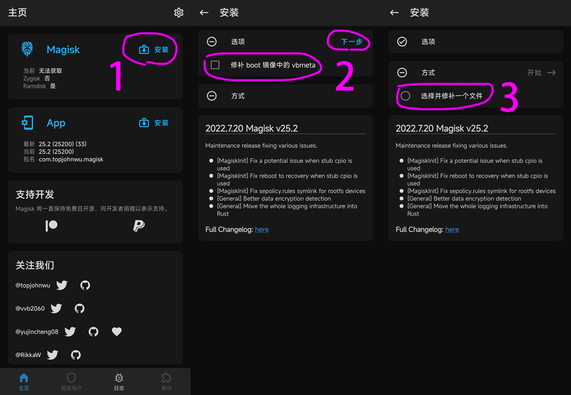
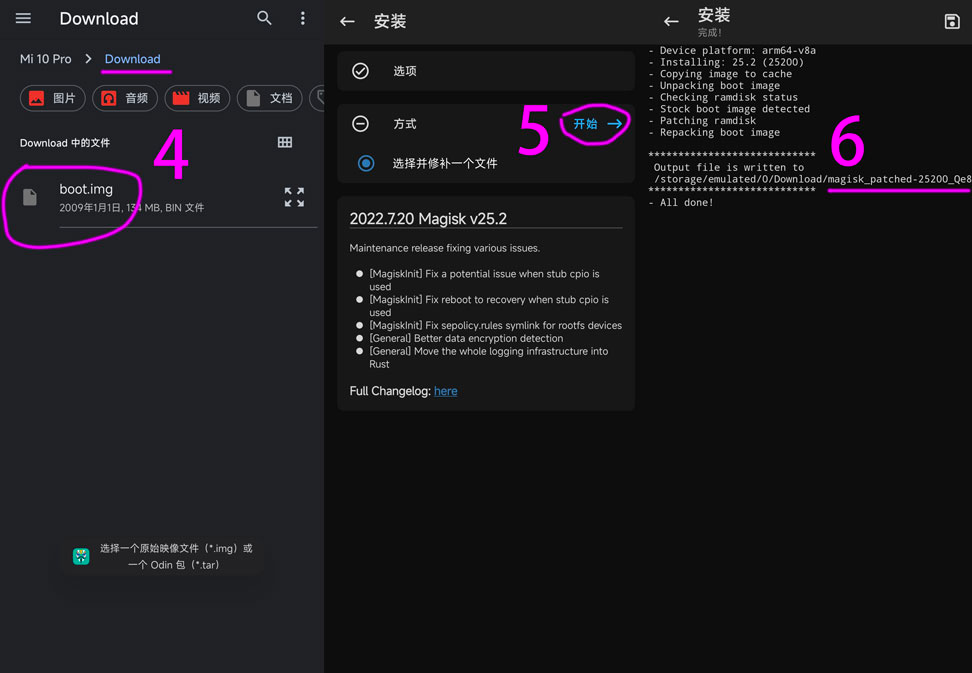
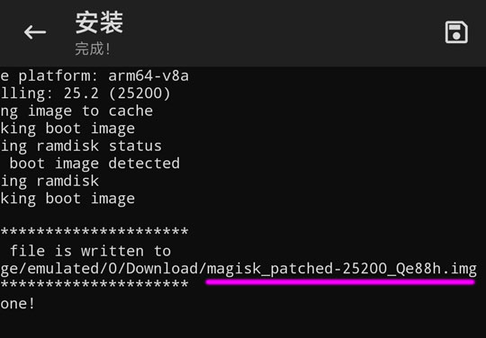

# 使用Magisk工具Root手机
 需要使用的工具Magisk, Magisk内部工具LSPosed-zygisk、LSPosed-riru、agisk-frida
 - Magisk 工具[下载地址](https://github.com/topjohnwu/Magisk/releases)
 - LSPosed组件[下载地址](https://github.com/LSPosed/LSPosed/releases)
 - Magisk-frida组件[下载地址](https://github.com/ViRb3/magisk-frida)


## Magisk安装步骤
### 1、Bootloader解锁
### 2、下载系统包
### 3、解包提取boot：[Payload-dumper-go-boot](https://magiskcn.com/payload-dumper-go-boot)（如果系统包有 boot.img，可以跳过此步骤）
### 4、手机插入电脑，文件传输模式，复制 boot.img 到手机 Download 目录
### 5、安装并修补boot.img

### 6、4.选择boot.img – 5.开始 – 6.修补成功

### 7、修补成功，会在 Download 目录生成（magisk_patched-版本_随机.img）文件，每次生成的随机字符都不一样，使用的时候请输入生成的名字。

### 8、电脑下载 [adb-fastboot](https://mrzzoxo.lanzoub.com/b02plghuh),[本地下载](adb/adb-fastboot.zip)（解压出来）
### 9、手机重启到 fastboot 模式（按电源键重启 马上按住 音量键 –）插上电脑
### 10、打开“打开CMD命令行.bat”，输入下面的命令
```shell
[root@xxx/]$ fastboot flash boot 
// 出现一下三行代码 表示成功
Sending 'boot' (131072 KB) OKAY [ 3.311s]
Writing 'boot' OKAY [ 0.441s]
Finished. Total time: 3.794s
```

温馨提示
如果刷模块不兼容或者其他骚操作导致不能开机，可以把我们前面提取的boot.img通过fastboot刷回去，恢复原系统，一般都能正常开机！
boot.img保留一份在电脑，避免出问题了可以自救下！还原boot指令
```shell
[root@xxx/]$ fastboot flash boot boot.img
```

### 11、如果失败无限重启
```shell

```


